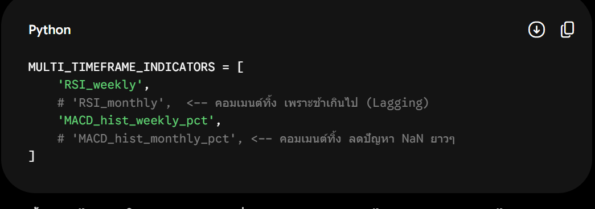

# เน้น Hyperparameter Tuning

* # 1

MULTI_TIMEFRAME_INDICATORS = [
    'RSI_weekly', 
    # 'RSI_monthly',  <-- คอมเมนต์ทิ้ง เพราะช้าเกินไป (Lagging)
    'MACD_hist_weekly_pct', 
    # 'MACD_hist_monthly_pct', <-- คอมเมนต์ทิ้ง ลดปัญหา NaN ยาวๆ
]

* # 2
> เปิด USE_MULTI_TIMEFRAME = True กลับมา แล้วไปแก้โค้ดที่ 
  dd_penalty = (abs(current_drawdown) - 0.05) * 15.0 (เพิ่มตัวคูณจาก 10 เป็น 15) เพื่อบังคับให้บอทที่เห็นภาพใหญ่ มีความขี้กลัวมากขึ้นตอนพอร์ตร่วง

* # 3
เพิ่มจำนวนรอบในการ train 

ในฟังก์ชัน train_model() เปลี่ยนแค่บรรทัดนี้บรรทัดเดียวครับ:

> แนะนำให้กลับไปใช้ 300,000 เหมือนที่คุณเคยรันได้ดีในตอนแรกครับ
    agent.learn(total_timesteps=300_000, callback=eval_callback)

# แหล่งอ้างอิง
https://share.gemini.google/NupAdaGJMtQU

# แหล่งอ้างอิงสำหรับผลทดสอบ (Prompt)
https://share.gemini.google/UFoY3S7rTETv

  # 4
  เปลี่ยนการ train แบบ sliding window

  